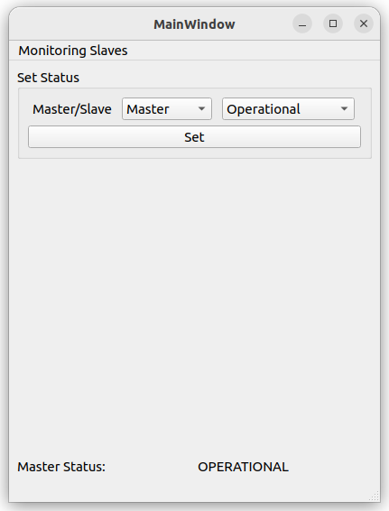

# ethercat_R1-EC_IO_Modules

This is a simple UI for controlling and monitoring your R1-EC I/O modules.
Like [R1-EC-5500](https://cdn.delta-emea.com/cs/download/file/4569491_1_DELTA_IA-IPC_R1-EC5500_UM_EN_20140905.pdf)

  


## Build

do run the build script:

``` ./build.bash ```

after that you will see a build folder!

## Run

after build, you can go to the build directory and run the *ethercat_R1-EC_IO_Modules* executable :

``` 
  cd build 
  sudo ./ethercat_R1-EC_IO_Modules
```

*Note*: You must run it with sudo!

then you will see a window to get your own ethernet interface so select your interface: 


if you select the correct ethernet interface and everything is ok, the main window will show.
